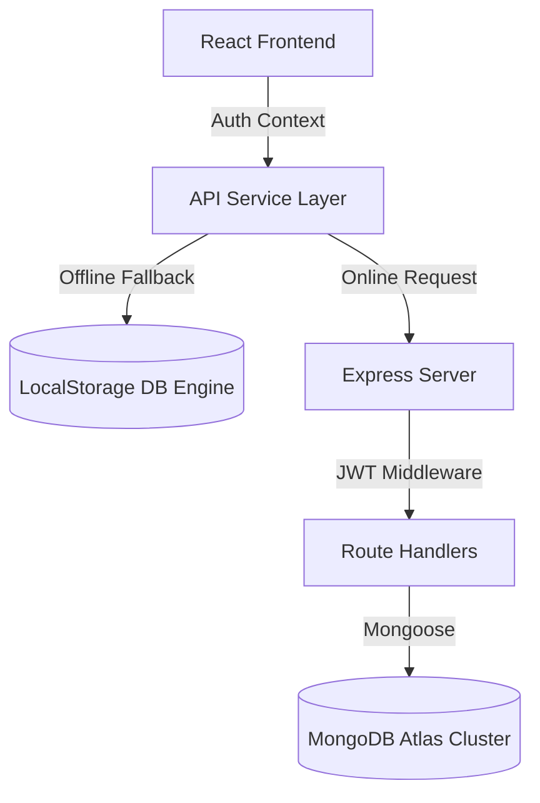

# LeaveSync — Leave Management System


**🚀 Live Demo:** [https://lmsnrolledshaktipriya.vercel.app/](https://lmsnrolledshaktipriya.vercel.app/)


LeaveSync is a full-stack, high-fidelity Leave Management System (LMS) designed for modern organizations to handle employee time-off requests, track leave balances, and manage administrative reviews with absolute ease.

It features a user interface with interactive dashboards, custom indicators, real-time notification polling, and a smart dual-engine API layer that operates seamlessly in both online database-connected mode and standalone offline mode.

---

## 🌟 Tech Stack

### Frontend (Client)
* **React 19**: Modern UI component architecture.
* **Vite**: Rapid hot module replacement dev server.
* **Tailwind CSS v4**: Advanced utility styles, customized gradients, glassmorphism, and smooth animation keyframes.
* **React Router DOM (v7)**: Protected routes and context-based path authorization redirectors.
* **React Context API**: Core authentication session provider.

### Backend (Server)
* **Node.js**: Asynchronous backend runtime.
* **Express.js (v5)**: Clean MVC routing structures and middleware wiring.
* **MongoDB & Mongoose**: Object modeling schemas, validations, and document storage.
* **JWT (JsonWebToken)**: State-free stateless authentication checks.
* **Bcrypt.js**: Security password salt hashing.

---

## 🏗️ Architecture



### Key Design Pillars
1. **Full-Stack Live Notifications**: Complete database-backed notifications system tracking unread message counts, status shifts, and reads.
   - Employees are notified of leave updates: `"Your leave request for 10 Jul - 12 Jul has been approved."`
   - Admins are notified of submissions: `"New leave request submitted by Shakti Priya."`
   - Real-time unread badges poll directly inside the glassmorphic navigation bar.
2. **Dual-Engine API Fallback**: The client API layer automatically health-checks the backend server. If the server is offline or inaccessible, the application automatically mounts a **high-fidelity LocalStorage Database** containing pre-configured mock credentials. The app remains fully functional, allowing you to test login, dashboards, leave applications, notifications, and approvals without running a database.
3. **Programmatic DNS Routing**: The backend server forcibly overrides Node's default system DNS resolver in favor of Google (`8.8.8.8`) and Cloudflare (`1.1.1.1`) public DNS servers. This prevents standard local system lookup failures (e.g. `querySrv ENOTFOUND`) when establishing connections to MongoDB Atlas.
4. **Role-Based Guards**: Protected routing guards automatically redirect unauthorized users. Employees are locked to `/employee`, and Admins are locked to `/admin` directories.

---

## 📸 Application Screenshots

*(Paste your screenshots below their respective headings)*

### 🏠 Home & Landing Page

<br/>

### 🔐 Authentication (Login & Register)

<br/>

### 👨‍💼 Admin Dashboard


<br/>


### 👥 Employee Dashboard & Leave Application


<br/>


### 🔔 Live Notifications 

<br/>
---

## 🛠️ Setup & Running

### Prerequisites
* [Node.js](https://nodejs.org/) (v18+ recommended)
* [MongoDB Atlas Account](https://www.mongodb.com/cloud/atlas) or Local MongoDB Instance

### Server Configuration
1. Navigate to the server folder:
   ```bash
   cd LMS/server
   ```
2. Open the `.env` file and configure your credentials:
   ```env
   PORT=5000
   MONGO_URI=mongodb+srv://<username>:<password>@cluster0.0oko7kh.mongodb.net/leavesync?retryWrites=true&w=majority
   JWT_SECRET=mysecret
   ```
3. Install dependencies and start the backend:
   ```bash
   npm install
   npm run dev
   ```

### Client Configuration
1. Navigate to the client folder:
   ```bash
   cd ../client
   ```
2. Install dependencies and run the Vite server:
   ```bash
   npm install
   npm run dev
   ```
3. The app will open at: `http://localhost:5173`

---

## 🔑 Pre-configured Mock Accounts (Standalone Mode)
If running without the MongoDB backend, you can sign in directly using these pre-seeded local storage credentials:

| Role | Email | Password | Starting Balance |
| :--- | :--- | :--- | :--- |
| **Employee 1** | `rahul@example.com` | `password123` | 20 Days |
| **Employee 2** | `priya@example.com` | `password123` | 15 Days |
| **Admin** | `admin@example.com` | `password123` | N/A |

---

## 🤖 AI Usage & Development

This project was developed in pair-programming collaboration with **Antigravity (by Google DeepMind)**.

### AI Integration Areas:
* **Full-Stack Live Notifications**: Designed schema models, route controllers, date range formatting helpers, and reactive dropdown notification menus.
* **Glassmorphic UI Design**: Crafted tailwind utility extensions, custom glow balls, transparent dashboard widgets, and float keyframes.
* **State Mock DB Engine**: Designed local storage fallback synchronization mechanisms that duplicate database behaviors (triggers, balance deduction, notifications dispatch).
* **Network & DNS Resolvers**: Overcame MongoDB connection lookup bugs by implementing code-level DNS overrides.
* **Component Restructuring**: Rewrote static views into state-driven React modules.

---

## 💡 Key Assumptions
* **Absence Calendar Boundaries**: Leave applications assume continuous calendar days (inclusive of weekends/holidays).
* **Leave Balances**: Default starting balance is 15 days for new employees. Leave balances are only deducted when a request's status changes from `PENDING` to `APPROVED`.
* **Notifications**: Local notifications poll every 8 seconds on the client for live UI refresh feedback in standalone mode.
